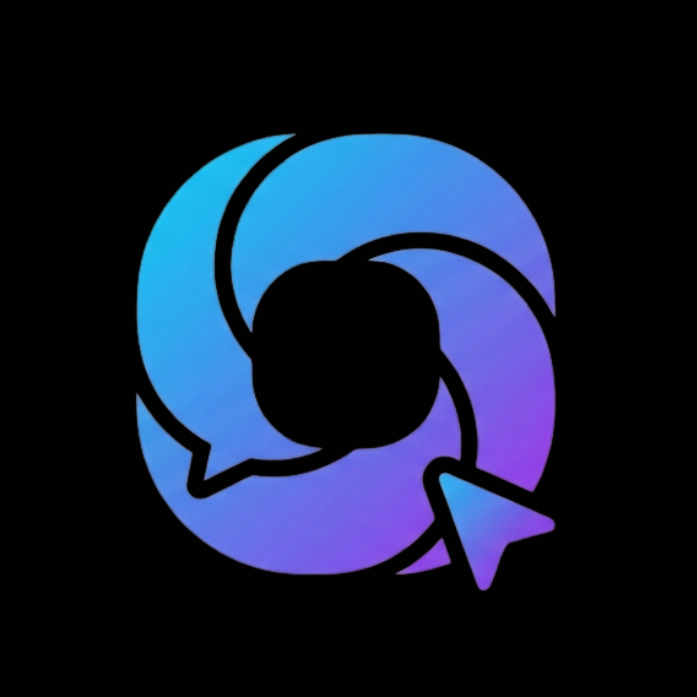

<p align="center">
  
</p>

<h1 align="center">ODRN by daulric</h1>

<p align="center">
  <strong>A modern communication app built for connection</strong>
</p>

<p align="center">
  <a href="#features">Features</a> •
  <a href="#tech-stack">Tech Stack</a> •
  <a href="#getting-started">Getting Started</a> •
  <a href="#project-structure">Structure</a> •
  <a href="#contributing">Contributing</a>
</p>

<p align="center">
  
  
  
  
</p>

---

## ✨ Features

### 📱 Social Feed
Browse and discover posts from the community. View images, read content, and engage with others.

### 💬 Direct Messaging
Real-time one-on-one messaging with friends. Get push notifications when you receive new messages, even when the app is closed.

### 📞 Voice Calling
Make peer-to-peer voice calls to your friends using WebRTC technology. Features include:
- Real-time audio communication
- Push notifications for incoming calls
- Accept/decline calls from notification
- Speakerphone toggle
- Active call indicator when navigating the app

### 👥 Friends System
- Send and receive friend requests
- View pending requests
- Manage your friends list
- Search for users to add

### 📤 Post Creation
Share moments with your network:
- Upload images (supports multiple images per post)
- Add text content
- Automatic image optimization and format conversion

### 👤 Profile
- Customizable username and avatar
- View your posts in a grid layout
- Online status indicator

### 🔔 Push Notifications
Stay connected with real-time notifications:
- Incoming call alerts with accept/decline actions
- New message notifications
- Works on both iOS and Android

---

## 🛠 Tech Stack

| Category | Technology |
|----------|------------|
| **Framework** | [React Native](https://reactnative.dev/) with [Expo](https://expo.dev/) |
| **Language** | [TypeScript](https://www.typescriptlang.org/) |
| **Styling** | [NativeWind](https://www.nativewind.dev/) (TailwindCSS) + [React Native Paper](https://reactnativepaper.com/) |
| **Backend** | [Supabase](https://supabase.com/) (Auth, Database, Realtime, Storage) |
| **Calling** | [WebRTC](https://webrtc.org/) via react-native-webrtc |
| **Navigation** | [Expo Router](https://docs.expo.dev/router/introduction/) |
| **Push Notifications** | [Expo Notifications](https://docs.expo.dev/push-notifications/overview/) + FCM/APNs |
| **Package Manager** | [Bun](https://bun.sh/) |

---

## 🚀 Getting Started

### Prerequisites

- [Bun](https://bun.sh/) (recommended) or Node.js 18+
- [Expo CLI](https://docs.expo.dev/get-started/installation/)
- iOS Simulator (Mac) or Android Emulator
- [Supabase](https://supabase.com/) project

### Installation

1. **Clone the repository**
   ```bash
   git clone https://github.com/daulric/odrn.git
   cd odrn
   ```

2. **Install dependencies**
   ```bash
   bun install
   ```

3. **Set up environment variables**
   
   Create a `.env` file in the root directory:
   ```env
   EXPO_PUBLIC_SUPABASE_URL=your_supabase_url
   EXPO_PUBLIC_SUPABASE_ANON_KEY=your_supabase_anon_key
   ```

4. **Set up the database**
   
   Run the SQL files in `supabase/sql/` in order (00, 01, 02, etc.) in your Supabase SQL editor.

5. **Start the development server**
   ```bash
   bun start
   ```

6. **Run on device/simulator**
   ```bash
   # iOS
   bun run ios
   
   # Android
   bun run android
   ```

> **Note:** Voice calling requires a development build (not Expo Go). Run `npx expo prebuild` then build with Xcode/Android Studio or use EAS Build.

---

## 📁 Project Structure

```
odrn/
├── app/                    # Expo Router screens
│   ├── (tabs)/            # Tab navigation screens
│   │   ├── index.tsx      # Home feed
│   │   ├── messages.tsx   # Friends & messaging
│   │   ├── upload.tsx     # Create posts
│   │   ├── profile.tsx    # User profile
│   │   └── more.tsx       # Settings & more
│   ├── chat/[id].tsx      # Chat screen
│   ├── call/[id].tsx      # Call screen
│   ├── posts/[id].tsx     # Single post view
│   └── auth.tsx           # Authentication
├── components/            # Reusable components
├── contexts/              # React contexts (Auth, Call)
├── hooks/                 # Custom hooks
├── lib/                   # Utilities & services
│   ├── calling/          # WebRTC & call logic
│   ├── notifications/    # Push notification setup
│   └── supabase.ts       # Supabase client
├── supabase/             # Database schema & docs
│   └── sql/              # SQL migration files
└── assets/               # Images, icons, fonts
```

---

## 🔧 Available Scripts

| Command | Description |
|---------|-------------|
| `bun start` | Start the Expo development server |
| `bun run ios` | Run on iOS simulator |
| `bun run android` | Run on Android emulator |
| `bun run web` | Run in web browser |
| `bun run lint` | Run ESLint |
| `bun run typecheck` | Run TypeScript type checking |
| `bun run prebuild:android` | Generate Android native project |
| `bun run prebuild:ios` | Generate iOS native project |

---

## 📱 Screenshots

<!-- Add your screenshots here -->
<p align="center">
  <i>Screenshots coming soon...</i>
</p>

---

## 🤝 Contributing

Contributions are welcome! Please feel free to submit a Pull Request.

1. Fork the repository
2. Create your feature branch (`git checkout -b feature/amazing-feature`)
3. Commit your changes (`git commit -m 'Add some amazing feature'`)
4. Push to the branch (`git push origin feature/amazing-feature`)
5. Open a Pull Request

---

## 📄 License

This project is open source and available under the [MIT License](LICENSE).

---

## 💖 Support

If you find this project helpful, consider [supporting development](https://donate.daulric.dev/).

---

<p align="center">
  Made by <a href="https://github.com/daulric">daulric</a>
</p>
