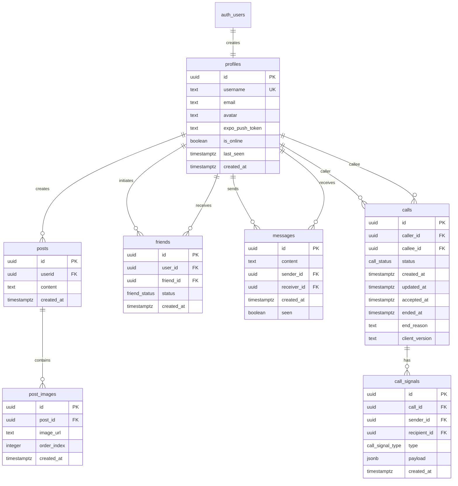
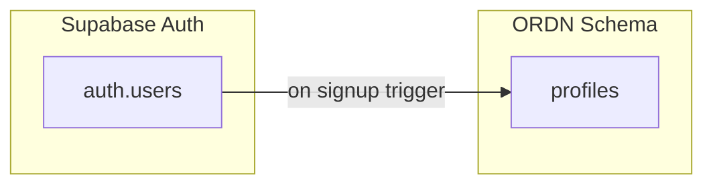
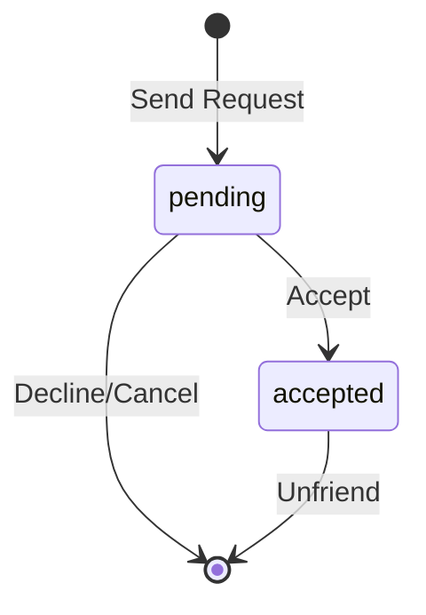
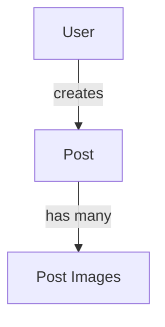
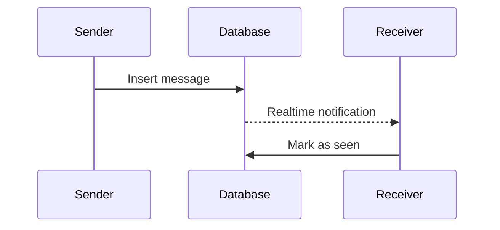
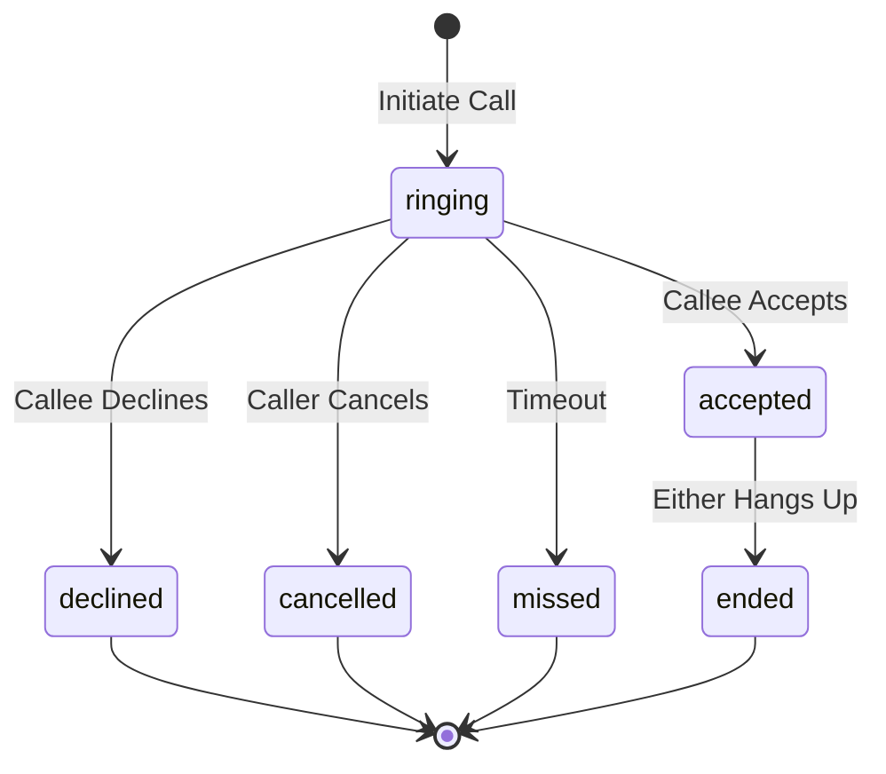
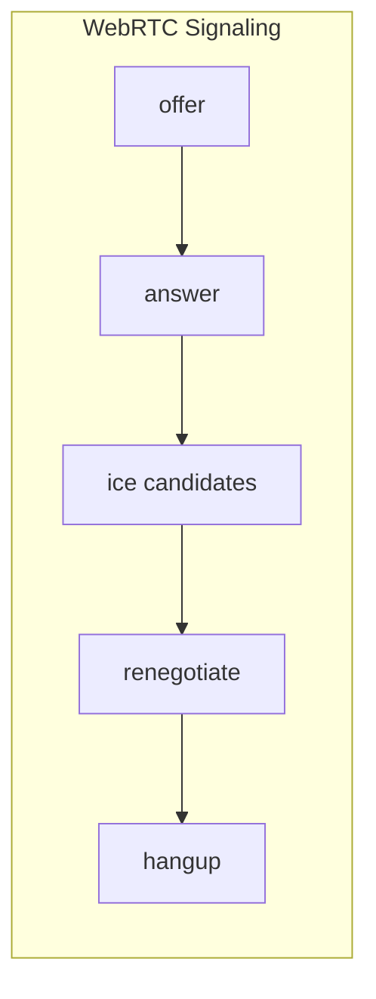

# ODRN Database Schema

This directory contains the SQL migration files for the ODRN application database. The database uses a custom schema called `ordn` and runs on Supabase (PostgreSQL).

## Execution Order

Run these files in numerical order in the Supabase SQL Editor:

```
00_schema.sql      →  Base schema and extensions
01_profiles.sql    →  User profiles (depends on auth.users)
02_friends.sql     →  Friend relationships (depends on profiles)
03_posts.sql       →  User posts (depends on profiles)
04_post_images.sql →  Post images (depends on posts)
05_messages.sql    →  Direct messages (depends on profiles)
06_calling.sql     →  Calls and signals (depends on profiles, friends)
```

## Entity Relationship Diagram



## Table Details

### profiles

User profile information linked to Supabase Auth.



| Column | Type | Description |
|--------|------|-------------|
| id | uuid | Primary key, references auth.users |
| username | text | Unique username |
| email | text | User email |
| avatar | text | Avatar URL |
| expo_push_token | text | Push notification token |
| is_online | boolean | Online status |
| last_seen | timestamptz | Last activity timestamp |
| created_at | timestamptz | Account creation time |

---

### friends

Friend relationships between users.



| Column | Type | Description |
|--------|------|-------------|
| id | uuid | Primary key |
| user_id | uuid | User who sent the request |
| friend_id | uuid | User who received the request |
| status | enum | 'pending' or 'accepted' |
| created_at | timestamptz | Request timestamp |

---

### posts

User-generated content posts.



| Column | Type | Description |
|--------|------|-------------|
| id | uuid | Primary key |
| userid | uuid | Author's profile ID |
| content | text | Post text content |
| created_at | timestamptz | Creation timestamp |

---

### post_images

Images attached to posts.

| Column | Type | Description |
|--------|------|-------------|
| id | uuid | Primary key |
| post_id | uuid | Parent post ID |
| image_url | text | Image storage URL |
| order_index | integer | Display order |
| created_at | timestamptz | Upload timestamp |

---

### messages

Direct messages between users.



| Column | Type | Description |
|--------|------|-------------|
| id | uuid | Primary key |
| content | text | Message text |
| sender_id | uuid | Sender's profile ID |
| receiver_id | uuid | Receiver's profile ID |
| created_at | timestamptz | Send timestamp |
| seen | boolean | Read status |

---

### calls

Voice/video call records.



| Column | Type | Description |
|--------|------|-------------|
| id | uuid | Primary key |
| caller_id | uuid | Caller's profile ID |
| callee_id | uuid | Callee's profile ID |
| status | enum | Call state |
| created_at | timestamptz | Call initiation time |
| updated_at | timestamptz | Last status change |
| accepted_at | timestamptz | When call was accepted |
| ended_at | timestamptz | When call ended |
| end_reason | text | Why call ended |
| client_version | text | App version |

---

### call_signals

WebRTC signaling messages (append-only).



| Column | Type | Description |
|--------|------|-------------|
| id | uuid | Primary key |
| call_id | uuid | Parent call ID |
| sender_id | uuid | Signal sender |
| recipient_id | uuid | Signal recipient (nullable) |
| type | enum | Signal type |
| payload | jsonb | Signal data (SDP, ICE, etc.) |
| created_at | timestamptz | Signal timestamp |

## Enums

### friend_status
- `pending` - Request sent, awaiting response
- `accepted` - Friendship confirmed

### call_status
- `ringing` - Call initiated, waiting for response
- `accepted` - Call in progress
- `declined` - Callee rejected
- `cancelled` - Caller cancelled
- `missed` - No response (timeout)
- `ended` - Call completed normally

### call_signal_type
- `offer` - WebRTC SDP offer
- `answer` - WebRTC SDP answer
- `ice` - ICE candidate
- `renegotiate` - Renegotiation request
- `hangup` - End call signal
- `control` - Control messages

## Helper Functions

| Function | Description |
|----------|-------------|
| `ordn.are_friends(a, b)` | Check if two users are friends |
| `ordn.get_friend_ids(user_id)` | Get all friend IDs for a user |
| `ordn.get_unread_count(user_id)` | Get total unread message count |
| `ordn.get_unread_count_from(user_id, from_id)` | Get unread count from specific user |
| `ordn.mark_messages_read(user_id, from_id)` | Mark messages as read |
| `ordn.handle_new_user()` | Auto-create profile on signup |

## Row Level Security

All tables have RLS enabled with policies ensuring:

- **profiles**: Public read, owner-only write
- **friends**: Participants can view/modify their relationships
- **posts**: Public read, owner-only write
- **post_images**: Public read, post owner can modify
- **messages**: Sender/receiver only access
- **calls**: Participants only, friends-only creation
- **call_signals**: Participants only, append-only

## Realtime

The following tables are added to `supabase_realtime` publication:
- `ordn.calls`
- `ordn.call_signals`

To enable realtime for messages:
```sql
alter publication supabase_realtime add table ordn.messages;
```

